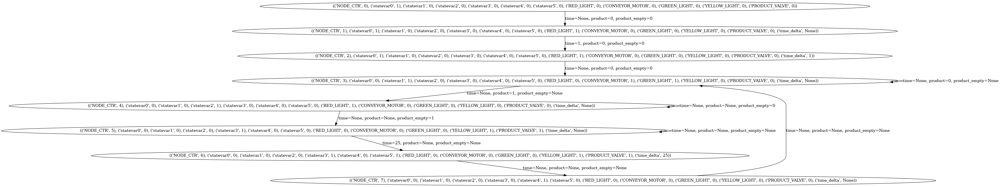
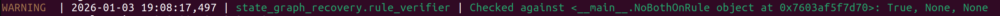
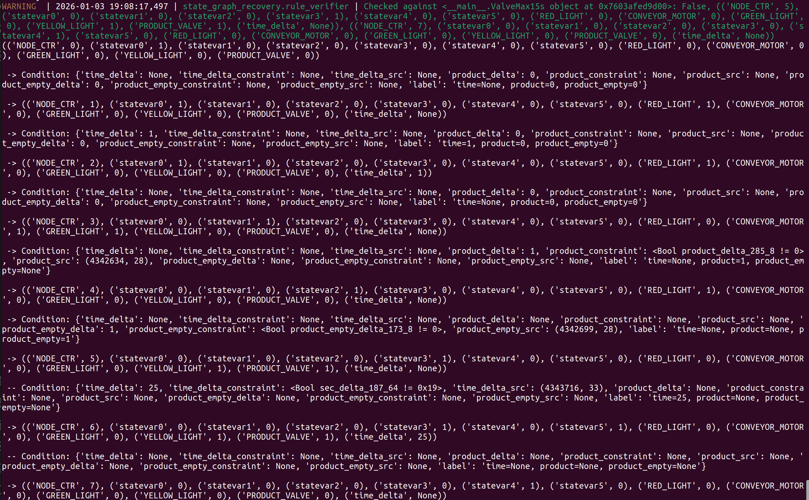

# Ta'veren

Ta'veren is a static analysis-based framework that recovers finite state machines (FSM) from PLC binaries and verifies safety policies to discover blind-trust vulnerabilities (BTV) in the PLC programs.
When PLC programs receive unexpected inputs (from peripherals) outside the consideration of PLC design, they may cause unsafe behaviors.
To find such vulerabilities, which may exist in "deep" part of the program, Ta'veren recovers the FSM implemented in the PLC program and applies model checking to verify safety policies against the recovered FSM.
To recover the FSM without suffering from state explosion, we build Ta'veren upon two ideas:
(1) deduplicate abstract states using state variables, and (2) discover meaningful input values that can trigger state transitions.
Our experiments show that Ta’veren recovers meaningful FSMs and uncovers safety violations with high effectiveness.

We describe the design and results of Ta'veren in our paper:  
[Discovering Blind-Trust Vulnerabilities in PLC Programs via Finite State Machine Recovery](https://bonnie1256.github.io/files/taveren.pdf)  
Fangzhou Dong, Arvind S Raj, Efrén López-Morales, Siyu Liu, Yan Shoshitaishvili, Tiffany Bao, Adam Doupé, Muslum Ozgur Ozmen and Ruoyu Wang  
_In Proceedings of Network and Distributed System Security (NDSS) Symposium 2026._

This repository includes the source code of Ta'veren and the dataset used in the paper.

## Overview
To use Ta'veren, you will need:
* The PLC binary (user input)
* The environment model that describes the interaction of the PLC with the physical world, which includes the addresses, sizes and types for input (sensor) and output (actuator) variables (user input, see [example](blob/master/packaging/test/packaging.json#L49-L120))
* The scan cycle function that implements the state machine (generated by [`scan_cycle_detection`](scan_cycle_detection/))
* Initialization functions (generated by [`init_finder`](init_finder/))
* State variables (generated by [`statevars`](statevars/))
* Safety policies (user input, see [example](blob/master/packaging/test/test_packaging.py#L33-L58))

Ta'veren will output:
* The recovered FSM
* The verification results for the safety policies

## Example outputs
An example recovered FSM:

An example verification result for a complied safety policy:

An example verification result for a violated safety policy:

## Prerequisites
* Python 3.12
* [angr](https://github.com/angr/angr) 9.2.189.dev0 with modifications. We highly recommend installing angr inside virtualenv.
    > mkvirtualenv -p python3.12 taveren  
  > workon taveren  
  > ./extremely-simple-setup.sh    

* [pygraphviz](https://pygraphviz.github.io/documentation/stable/install.html) for visualization
    > sudo apt-get install graphviz graphviz-dev  
  > pip install pygraphviz
